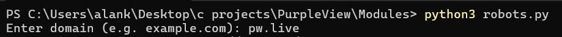
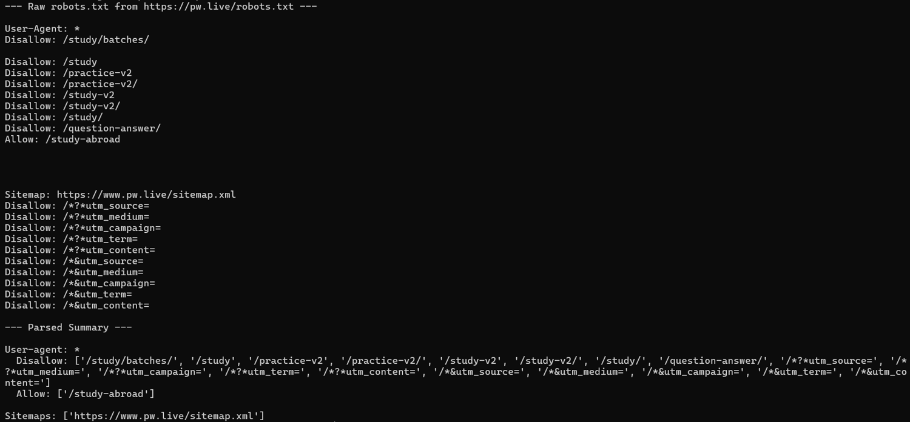

# 🛡️ Purple View
Passive Reconnaissance Tool for Penetration Testing | Project Based Learning (TCS332)

---

## 📖 Over View
The **Attack Surface Mapper** is a command-line reconnaissance utility designed to help penetration testers understand a target website before any active testing begins.  
It performs **passive information gathering only** collecting publicly accessible data such as HTTP headers, cookies, robots.txt, sitemap.xml, JavaScript files, HTML forms, and discoverable URLs.  

Findings are automatically checked against security best practices (e.g., CSP, HSTS, X-Frame-Options) to highlight potential misconfigurations.

---

## 🎯 Objectives
- Automate the **information gathering phase** of ethical hacking.  
- Apply core concepts: **HTTP, cookies, security headers, access control**.  
- Generate a **structured, exportable report** of a target’s attack surface.  

---

## ⚡ Key Features
| Feature | Description |
|---------|-------------|
| Target Manager | Add, store, and re-scan targets |
| robots.txt & sitemap.xml | Discover hidden paths and indexing rules |
| HTTP Header Viewer | Check CSP, HSTS, X-Frame-Options |
| Cookie Viewer | Verify Secure, HttpOnly, SameSite flags |
| Technology Detection | Identify server banners, JS libraries |
| JavaScript Listing | Extract linked JS files |
| HTML Form Detection | Capture method, action, input fields |
| URL Discovery | Crawl in-page links and parameters |
| Export | JSON / CSV reports |

---

## 🛠 Tools & Technologies
| Category             | Tool / Technology | Purpose |
|----------------------|------------------|---------|
| Programming Language | Python 3         | Core application logic |
| HTTP Communication   | requests         | Sending HTTP requests |
| HTML Parsing         | BeautifulSoup    | Extracting forms, scripts, links |
| Pattern Matching     | regex (re)       | URL & parameter extraction |
| Data Storage         | SQLite3          | Local DB for targets & findings |
| Backend Framework    | FastAPI (optional) | REST API layer |
| Output Formatting    | rich             | CLI tables & formatting |
| Data Export          | JSON / CSV       | Reporting |
| Environment          | Linux (Bash)     | CLI execution |
| Version Control      | Git & GitHub     | Collaboration |

---

## 📚 Required Knowledge
- **Python**: OOP, requests, regex, JSON, file handling  
- **Backend**: FastAPI, SQLite, CRUD, REST APIs  
- **Security**: Reconnaissance methodology, HTTP protocol, cookies, headers, OWASP basics  

---

## ✅ Ethical Scope
- **Passive only**: reads public info (headers, robots.txt, sitemap, page source).  
- No exploitation, modification, or disruption.  
- Safe for academic demonstration on live or self-hosted targets.  

---

## 🎓 Expected Outcome
A working **CLI tool** that:  
- Accepts a target URL  
- Performs automated reconnaissance  
- Stores results in SQLite  
- Generates a structured, exportable summary of the attack surface  

---

| Snapshot | Description |
|----------|-------------|
|  | User entering domain in CLI |
|  | Parsed robots.txt rules |

---

## 🚀 How to Run
```bash
# Clone the repository
git clone https://github.com/primeSHADDU/PurpleView.git
cd PurpleView

# Install dependencies (if applicable)
npm install   # or pip install -r requirements.txt

# Run locally
npm start     # or python app.py

